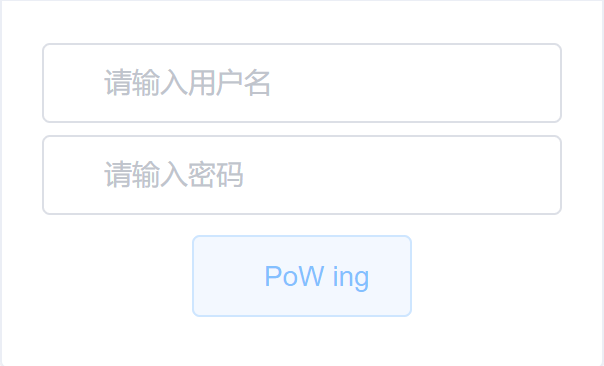

# PoW-captcha

A PoW-based captcha for your web application.



## require

- nodejs >= v12.16.0

## How to use

### Install

```shell
npm i @yalexin/pow-captcha
```
## Usage

⚡You must design the server logic for the pow, and you can refer to [API](#API)

### Basic Usage

```javascript
const Captcha = require("@yalexin/pow-captcha");
const [api1, api2] = ['http://server.com/powConfig', 'http://server.com/powVerify'];
Captcha.startPoW(api1, api2).then(res => {
    console.log(res);
}).catch(e => {
    console.log(e);
}
)
```
### Advanced Usage

You may want to use your request object , such as `axios`

```javascript
const Captcha = require("@yalexin/pow-captcha");
const [api1, api2] = ['http://server.com/powConfig', 'http://server.com/powVerify'];
Captcha.getPoWWithAxios(api1, this.$axios).then(config => {
    Captcha.tryPoWWithAxios(api2, config, this.$axios).then(verifyResult => {
        console.log('verifyResult = ', verifyResult);
    }).catch(e => {
        console.log(e);
    })
    }).catch(e => {
        console.log(e);
    }
)
```


⚡You must design the server logic for the pow

## API

### server

#### 1. getConfig

In server,You must return json data in `/powConfig`

The format of return data may be like this:

```json
{"difficulty":5,"prefix":"Ve03Plle"}
```

where `difficulty`indicates the difficulty of the pow puzzle and `prefix`indicates the random string.

The thing of client must to do is that find a `paddingNum`,which satisfies:

```
md5(prefix+string(paddingNum))=000...00xxxx
```

where the number of leading zeros at least `difficulty`.

For example with Java Spring Boot:

```java
// @Controller
@GetMapping("/powConfig")
public ResponseEntity getPowConfig(HttpServletRequest request,
                                   HttpServletResponse response) {
    Map map = userService.getPowConfig(request, response);
    return new ResponseEntity(map, HttpStatus.OK);
}
// @Service
@Override
public Map getPowConfig(HttpServletRequest request, HttpServletResponse response) {
    String randomString = getRandomString(powPrefixLength);
    HashMap<Object, Object> hashMap = new HashMap<>();
    hashMap.put("prefix", randomString);
    hashMap.put("difficulty", powDifficulty);
    request.getSession().setAttribute("powConfig", hashMap);
    return hashMap;
}
private String getRandomString(int length) {
    String str = "abcdefghijklmnopqrstuvwxyzABCDEFGHIJKLMNOPQRSTUVWXYZ0123456789";
    Random random = new Random();
    StringBuffer sb = new StringBuffer();
    for (int i = 0; i < length; i++) {
        int number = random.nextInt(62);
        sb.append(str.charAt(number));
    }
    return sb.toString();
}
```


#### 2. powVerify

 In `/powVerify`，you will get the data posted by client, where data likes:

```json
{
    "data":{
        "md5Str":"00000119414c7a8c9678b96fbc4954be",
        "paddingNum":300880
    }
}
```

You must verify two things:

1. `md5Str==md5(prefix+paddingNum)`
2. The leading zeros of  `md5Str`must at least `difficulty`

`difficulty` and `prefix` correspond to the value you gave the client earlier.

For example with Java Spring Boot:

```java
// @Controller
@PostMapping("/powVerify")
public ResponseEntity powVerify(HttpServletRequest request,
                                HttpServletResponse response, @RequestBody JSONObject json) {
    Map map = userService.verifyPow(request, response, json.getJSONObject("data"));
    return new ResponseEntity(map, HttpStatus.OK);
}
// @Service
public Map verifyPow(HttpServletRequest request, HttpServletResponse response, JSONObject json) {
    HttpSession session = request.getSession();
    try {
        HashMap powConfig = (HashMap) session.getAttribute("powConfig");

        String sessionPrefix = (String) powConfig.get("prefix");
        int difficulty = (int) powConfig.get("difficulty");
        String md5Str = (String) json.get("md5Str");
        int paddingNum = (int) json.get("paddingNum");

        String hashCode = MD5Utils.code(sessionPrefix + (paddingNum));
        // If the session has not generated a prefix, 
        // or if the prefix is empty, 
        // or if the hash value is incorrect, 
        // or if the complexity of the hash value is incorrect, 
        // the validation fails.
        if (sessionPrefix == null || "".equals(sessionPrefix) || !hashCode.equals(md5Str) || !checkHash(hashCode, difficulty)) {
            HashMap hashMap = new HashMap<>();
            hashMap.put("verify", false);
            // Re-generating random prefixes
            String randomString = getRandomString(powPrefixLength);
            hashMap.put("prefix", randomString);
            hashMap.put("difficulty", powDifficulty);
            session.setAttribute("powConfig", hashMap);
            return hashMap;
        } else {
            HashMap hashMap = new HashMap<>();
            hashMap.put("verify", true);
            session.setAttribute("powVerifyResult", true);
            return hashMap;
        }
    } catch (NullPointerException e) {
        HashMap hashMap = new HashMap<>();
        hashMap.put("verify", false);
        // Re-generating random prefixes
        String randomString = getRandomString(powPrefixLength);
        hashMap.put("prefix", randomString);
        hashMap.put("difficulty", powDifficulty);
        session.setAttribute("powConfig", hashMap);
        return hashMap;
    }

}
private boolean checkHash(String hashStr, int difficulty) {
    int zeroCnt = 0;
    for (int idx = 0; idx < difficulty; idx++) {
        if (hashStr.charAt(idx) != '0') break;
        zeroCnt++;
    }
    return zeroCnt >= difficulty;
}
```

You can get more detail about the server logic form my [repository](https://github.com/YaleXin/rblog-serv/blob/main/src/main/java/top/yalexin/rblog/service/UserServiceImpl.java)

### client

`Captcha.startPoW()` and `Captcha.tryPoWWithAxios()`  will return a object if pow-process is success.

```js
{
    verify: true, 
    totalTryCnt: totalTryCnt
}
```

|    field    |                description                |
| :---------: | :---------------------------------------: |
|   verify    |        The result of server verify        |
| totalTryCnt | The total times of try to find paddingNum |

